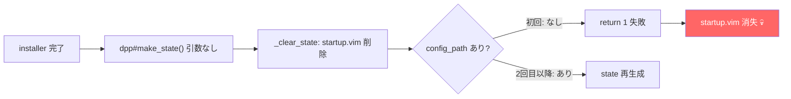
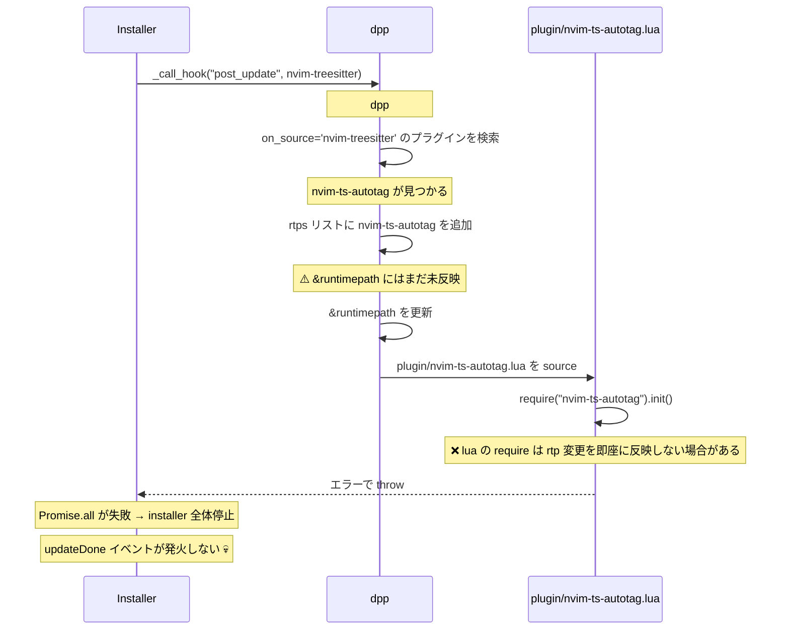

# dpp.vim ハマりポイント集

dpp.vim のセットアップで実際に遭遇した問題と、その原因・解決策をまとめる。
公式ドキュメントには記載のない内容が中心。

---

## 1. startup.vim が消失する

### 症状

`:DppInstall` 後に再起動すると `load_state: no cache` となり、
プラグインが一切読み込まれない。

### 原因

dpp-ext-installer は install/update 完了後に `dpp#make_state()` を
**引数なし**で自動呼び出しする（main.ts 646行目）。

```
dpp#make_state() の内部処理:
  1. _clear_state() → startup.vim, state.vim を削除 ← ここで消える
  2. config_path を取得 → g:dpp.settings.config_path を参照
  3. config_path が空 or 読めない → return 1 (失敗)
  → startup.vim は削除されたまま、再生成されない
```

初回インストール時は `g:dpp.settings.config_path` がセットされていないため、
引数なし `dpp#make_state()` は必ず失敗する。



### 解決策

`Dpp:ext:installer:updateDone` イベントをフックし、
`dpp#make_state(base, config_path)` を**引数付き**で再実行する。

```lua
vim.api.nvim_create_autocmd("User", {
  pattern = "Dpp:ext:installer:updateDone",
  callback = function()
    -- 引数付きで呼ぶことで config_path の問題を回避
    vim.fn["dpp#make_state"](dpp_base, dpp_config_path)
  end,
  once = true,
})
```

installer 内部の引数なし呼び出しは失敗するが、
直後に updateDone → 引数付き make_state で回復する。

---

## 2. .dpp にプラグインファイルがマージされない

### 症状

キャッシュからの起動時に以下のようなエラーが大量に出る：
```
Unknown function: ddu#custom#patch_global
E5108: Error executing lua: module 'nvim-surround' not found
```

### 原因

`dpp#make_state` は `#mergePlugins` で merged プラグインのファイルを `.dpp` に
ハードリンクする。しかし、**プラグインが clone されていない時点で make_state を
実行すると、ディレクトリが存在しないプラグインはスキップされる**。

```
#mergePlugins の処理（dpp.ts 596-618行目）:
  for (各 merged プラグイン) {
    if (!プラグインディレクトリが存在する) → スキップ  ← ここ
    for (各ファイル) {
      ハードリンクを作成
    }
  }
```

初回の make_state はプラグイン clone 前に実行されるため、
`.dpp` には dpp.vim と denops.vim のファイルしかマージされない。

### 解決策

DppInstall で clone 完了後に make_state を**再実行**する（Stage 3）。
全プラグインが clone 済みの状態で `#mergePlugins` が走るため、
正しくマージされる。

---

## 3. on_source プラグインの plugin/ スクリプトエラー

### 症状

`:DppInstall` 実行中に以下のようなエラーが出て installer が停止する：
```
E5113: Error while calling lua chunk:
  .../nvim-ts-autotag/plugin/nvim-ts-autotag.lua:1:
  module 'nvim-ts-autotag' not found
```

### 原因

installer の内部処理フロー：



nvim-treesitter に `hook_post_update = 'TSUpdate'` があるため、
installer が `_call_hook("post_update", nvim-treesitter)` を呼ぶ。
この中で `dpp#source("nvim-treesitter")` が実行され、
`on_source = 'nvim-treesitter'` の全プラグインが連鎖的に source される。

nvim-ts-autotag の `plugin/nvim-ts-autotag.lua` は裸の `require` を含んでおり、
rtp 反映のタイミング問題で失敗する。このエラーが throw されると
**installer の Promise.all 全体が停止**し、`updateDone` が発火しない。

### 解決策

2つの対策を組み合わせる：

#### A. on_source を on_ft に変更

```toml
# NG: installer 時に nvim-treesitter 経由で連鎖 source される
on_source = 'nvim-treesitter'

# OK: ファイルタイプ起動なので installer 時に source されない
on_ft = ['html', 'javascript', 'typescript', ...]
depends = ['nvim-treesitter']
```

#### B. hook_source を pcall で保護

plugin/ スクリプトのエラーは防げないが、hook_source のエラーは防げる。

```toml
hook_source = '''
lua <<EOF
local ok, autotag = pcall(require, 'nvim-ts-autotag')
if ok then autotag.setup() end
EOF
'''
```

### 同様の問題が起きうるプラグイン

`on_source = 'nvim-treesitter'` かつ `plugin/` に裸の `require` があるプラグインは
すべて同じ問題が起きる。現在の設定では以下が該当していた：

| プラグイン | plugin/ の require | 対策 |
|-----------|-------------------|------|
| nvim-ts-autotag | `require("nvim-ts-autotag").init()` (裸) | on_ft に変更 |
| nvim-ts-context-commentstring | `pcall(require, ...)` (保護済み) | 問題なし |
| hlargs.nvim | plugin/ なし | 問題なし |
| nvim_context_vt | autocmd 内の require (遅延) | 問題なし |

---

## 4. depends 未設定による hook_source エラー

### 症状

```
E5108: Error executing lua: module 'mason' not found
```

mason-lspconfig.nvim の hook_source で `require('mason')` が失敗する。

### 原因

dpp#source はプラグインの `depends` フィールドに基づいてトポロジカルソートする。
`depends` が未設定だと、依存先プラグインが source される前に
依存元の hook_source が実行される可能性がある。

### 解決策

plugins.toml で `depends` を明示する：

```toml
[[plugins]]
repo = 'mason-org/mason-lspconfig.nvim'
depends = ['mason.nvim', 'nvim-lspconfig']
```

同様に、アイコンフォントに依存するプラグインにも `depends` が必要：

```toml
[[plugins]]
repo = 'nvim-lualine/lualine.nvim'
depends = ['nvim-web-devicons']
```

---

## 5. DppInstall 時に dpp#source() を呼んではいけない

### 症状

DppInstall の Stage 1（初回 make_state 後）で `dpp#source()` を呼ぶと、
まだ clone されていないプラグインの hook_source がエラーになる。

### 原因

Stage 1 の時点ではプラグインが一切 clone されていない。
`dpp#source()` は全プラグインの hook_source を実行しようとするが、
`require('some-plugin')` が軒並み失敗する。

### 解決策

DppInstall の Stage 1 では `dpp#min#load_state()` のみ呼び、
`dpp#source()` は呼ばない。`dpp#source()` が必要なのは
`dpp#async_ext_action` を呼ぶために `config_path` を設定するためだが、
`load_state` だけで `config_path` は設定される。

```lua
-- Stage 1 の makeStatePost コールバック
callback = function()
  vim.fn["dpp#min#load_state"](dpp_base)  -- config_path をセット
  -- vim.fn["dpp#source"]()  ← これは呼ばない！
  vim.cmd("call dpp#async_ext_action('installer', 'install')")
end
```

---

## 6. Windows 固有: ddu-source-rg の nul ファイル問題

### 症状

プロジェクトルートに `nul` というファイルが生成される。

### 原因

ddu-source-rg が stdin に `/dev/null` を指定しているが、
Windows では `/dev/null` が存在しないため `nul` というファイルが作成される。

### 解決策

手動で修正し、`installerFrozen = true` で更新を凍結する：

```toml
[[plugins]]
repo = 'Shougo/ddu-source-rg'
[plugins.extAttrs]
installerFrozen = true
```

---

## トラブルシューティング手順

### 1. まずログを確認

```vim
:messages          " Neovim のメッセージ履歴
:Messages          " クリップボードにコピー（カスタムコマンド）
```

### 2. state をクリーンリビルド

```vim
:DppMakeState      " TOML の変更を反映して state 再構築
```

### 3. キャッシュクリア

```vim
:DppClearCache
" → Neovim を再起動する
```

### 4. 完全リセット

```powershell
# PowerShell で実行
Remove-Item -Recurse -Force "$env:LOCALAPPDATA\nvim-data\dpp"
```

その後 Neovim を起動するだけで自動復旧する（再起動不要）。
