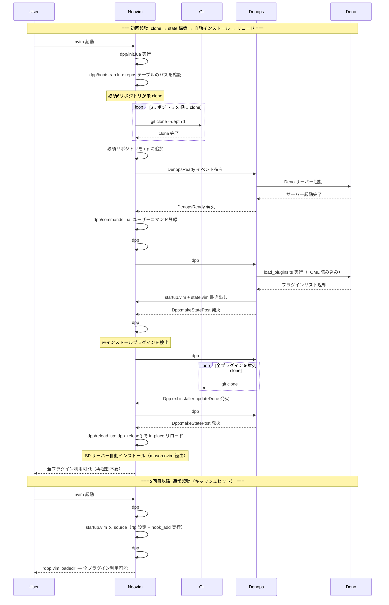
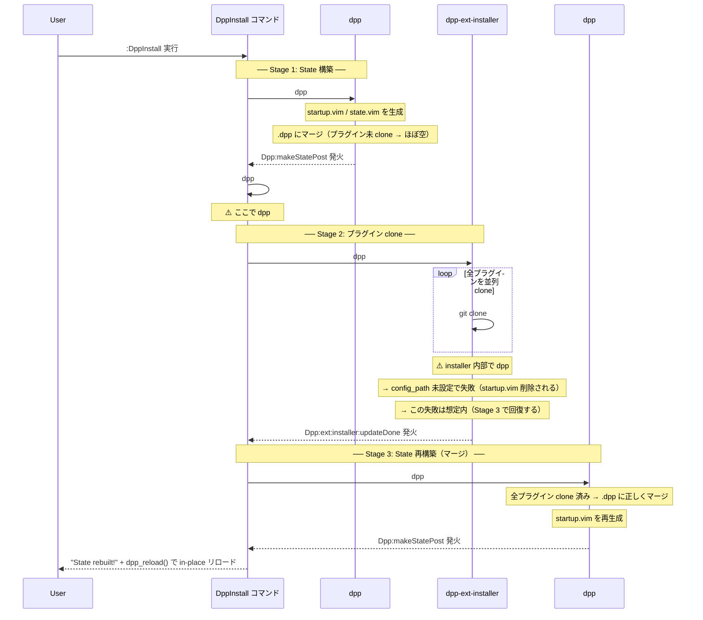
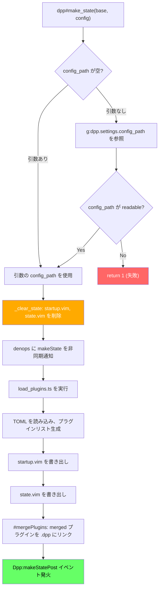

# dpp.vim セットアップガイド

dpp.vim は Shougo 氏が開発した Deno ベースの次世代プラグインマネージャー。
公式ドキュメントにはない実践的なセットアップ手順をまとめる。

## 前提条件

| ツール | バージョン | 確認コマンド |
|--------|-----------|-------------|
| Neovim | 0.11+     | `nvim --version` |
| Deno   | 2.x+      | `deno --version` |
| Git    | 任意      | `git --version` |
| Node.js| 18+       | `node --version` (mason.nvim 用) |

Windows の場合は PowerShell 7 (`pwsh`) を推奨。

## ファイル構成

```
nvim/
├── init.lua                  エントリポイント（load_extensions フラグで拡張機能を制御）
├── lua/
│   ├── core/                 基本設定（常に読み込み）
│   │   ├── options.lua       vim.opt 設定群
│   │   ├── keymaps.lua       プラグイン非依存キーマップ
│   │   ├── autocmds.lua      基本 autocmd
│   │   ├── project.lua       プロジェクト検出
│   │   └── ui.lua            フォールバック UI
│   ├── config/
│   │   └── settings.lua      集約設定（LSP サーバーリスト等）
│   └── plugins/              プラグイン設定（拡張機能モード時のみ）
├── dpp/
│   ├── init.lua              dpp エントリポイント
│   ├── utils.lua             共通定数・関数
│   ├── bootstrap.lua         必須リポジトリの git clone
│   ├── reload.lua            in-place リロード
│   ├── commands.lua          ユーザーコマンド定義
│   ├── load_plugins.ts       TypeScript: TOML→プラグインリスト変換
│   └── plugins.toml          プラグイン定義
└── autoload/dpp/ext/
    └── installer.vim         installer の表示カスタマイズ（任意）
```

### データディレクトリ（自動生成）

```
%LOCALAPPDATA%/nvim-data/dpp/
├── repos/github.com/         git clone されたプラグイン群
│   ├── Shougo/dpp.vim/
│   ├── vim-denops/denops.vim/
│   └── ...
└── nvim/                     dpp のステートディレクトリ
    ├── .dpp/                  merged プラグインのファイル群（ハードリンク）
    ├── startup.vim            runtimepath 設定・hook_add 実行
    └── state.vim              プラグインの JSON 状態データ
```

## 初回セットアップフロー

初回起動で自動的にすべての処理が完了する（再起動不要）。



## DppInstall の内部フロー

`:DppInstall`（`dpp/commands.lua` で定義）は3段階の非同期処理で構成される。
初回起動時は `dpp/init.lua` の `_first_time_build()` が同等の処理を自動実行する。



### なぜ3段階必要なのか

1. **Stage 1**: installer を呼ぶには `config_path` が必要。`dpp#make_state` で `startup.vim` を生成し、`load_state` で `config_path` をセットする
2. **Stage 2**: installer がプラグインを clone する。内部で `dpp#make_state()` を引数なしで呼ぶが、これは失敗する（後述の「ハマりポイント」参照）
3. **Stage 3**: clone 完了後に `dpp#make_state` を引数付きで再実行。全プラグインが揃っているので `.dpp` ディレクトリに正しくマージされる

## dpp#make_state の内部動作



**重要**: `_clear_state`（G）は `makeState`（H 以降）の**前に同期的に実行される**。
つまり、`makeState` が何らかの理由で失敗すると、startup.vim が削除されたまま放置される。

## merged プラグインの仕組み

dpp.vim は non-lazy プラグインをデフォルトで `merged = true` として扱う。

**merged とは**: プラグインのファイル（autoload/, lua/, plugin/ 等）を `.dpp` ディレクトリにハードリンクで集約し、個別の runtimepath 追加を省略する仕組み。

```
merged = true の条件:
  - lazy でない（on_source, on_ft, on_event, on_cmd 等がない）
  - local でない
  - hook_post_update がない（※ 正確には if, local, build がないこと）

merged プラグインの特徴:
  - runtimepath に個別追加されない（.dpp が rtp にあれば OK）
  - autoload/, lua/, plugin/ 等のファイルが .dpp にハードリンク
  - doc/, ftdetect/ は全プラグイン（merged 問わず）からマージ
```

## plugins.toml の書き方

### 基本

```toml
[[plugins]]
repo = 'author/plugin-name'
```

### 遅延ロード（lazy）

```toml
# 特定のファイルタイプで読み込み
on_ft = ['html', 'javascript']

# 特定のプラグインが source された時に連動
on_source = 'nvim-treesitter'

# 特定のイベントで読み込み
on_event = 'CmdlineEnter'

# 特定のコマンドで読み込み
on_cmd = ['CccPick', 'CccConvert']
```

### フック

```toml
# startup.vim に書き込まれ、起動時に実行される
hook_add = '''
nnoremap <silent> sg :<C-u>call <SID>ddu_rg()<CR>
'''

# dpp#source() で実行される（プラグインが rtp に追加された後）
hook_source = '''
lua require('plugin').setup()
'''

# clone/update 後に実行される
hook_post_update = 'TSUpdate'
```

### 依存関係

```toml
[[plugins]]
repo = 'mason-org/mason-lspconfig.nvim'
depends = ['mason.nvim', 'nvim-lspconfig']
```

`depends` を指定すると `dpp#source` 時にトポロジカルソートされ、
依存先が先に source される。

## セットアップ後の日常操作

| やりたいこと | コマンド |
|-------------|---------|
| plugins.toml の変更を反映 | `:DppMakeState`（in-place リロード） |
| 新しいプラグインをインストール | `:DppInstall`（clone + リロード） |
| プラグインを更新 | `:DppUpdate`（pull + リロード） |
| キャッシュをクリア | `:DppClearCache`（次回起動時に再構築） |
| 不要なプラグインを削除 | plugins.toml から削除 → `:DppClean` → `:DppMakeState` |
| LSP サーバーを追加 | `:Mason` → GUI でインストール |
| Treesitter パーサーを追加 | `:TSInstall {lang}` |
